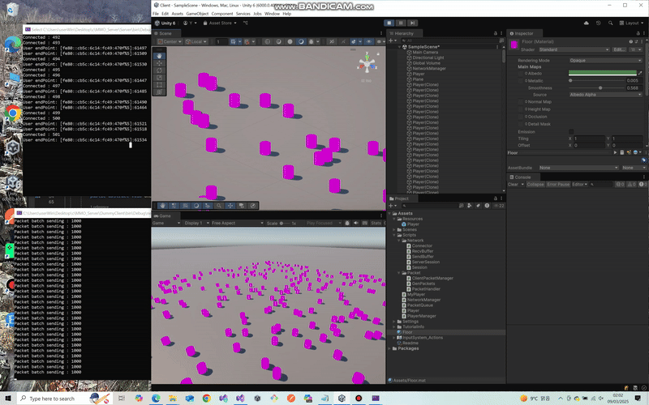

# Ranking App integrated with Blazor + WebApi + Unity 


<div style="display: flex; justify-content: space-around;">
  
  
  
</div>


---
---
<br>


# Overview
This repository is an MMO game server project developed using C# and .NET. It implements a basic server architecture and socket communication, aiming for a stable and scalable server. The project was created to gain practical experience in server development utilizing C# and .NET.


---
---
<br>


# Feature


1. Network Communication: 
  - Implements client-server communication using UDP sockets method it likes send/receive method . 
<br>

2. Multithreading:
  - Establishes a multithreaded environment for handling multiple client connections by using spine lock.  
<br>
  
3. Packet Serialization/Deserialization:
  - Handles data serialization and deserialization using Protocol Buffers..  
<br>

4. Job Queue:
  - Implements a job queue system for efficient management and sequential execution of server tasks( Command Design pattern).
<br>


---
---
<br>

# Core technologies


**1. Client Session management** 
- Singleton Pattern: Provides a globally accessible single instance _session ensuring a single session manager throughout the application.
- Session Data Management: Uses a synchronized dictionary _sessions to store and manage client sessions with unique IDs, secured by _lock for thread safety.
- Session Management Methods: Supports creation (Generate), retrieval (Find), and removal (Remove) of client sessions.
- Thread Safety: Ensures thread-safe operations by synchronizing dictionary access using the _lock object..
<br>

**2. Packet Manaagement** - RESTful API backend for JSON communication. 

- Packet Handling Mapping Table:
Defines mappings (_makeFunc, _handler) to dynamically associate packet IDs with their creation and handling logic.

- Packet Registration System:
Organizes packet processing by registering specific packet types with their corresponding handlers during initialization.

- Packet Reception and Processing:
Processes incoming network data by identifying packet types and delegating them to appropriate handlers.

- Packet Creation and Handling:
Generates and dispatches packet instances, linking raw data to their handling routine
<br>

**3. Unity Networking** - Connects to a server using DNS, transmits data via ServerSession, and asynchronously processes network packets through PacketQueue and PacketManager within Unity's update loop..
<br>


---
---
<br>


# Project structure

```graphql
MMO Game Server/ 
│── Client/ # Unity script
│ ├── Asset/ 
│ │ ├── Scripts/ 
│ │ │ ├── Network/ 
│ │ │ │ ├── Connector/ # Setup TCP client connection
│ │ │ │ ├── RecvBuffer/ # Stores received data and manages read/write positions
│ │ │ │ ├── SendBuffer/ # Allocates send data buffer
│ │ │ │ ├── ServerSession/ # Handle packet transmission with server
│ │ │ │ ├── Session/ # Create session
│ │ │ ├── Packet/ 
│ │ │ │ ├── ClientPacketManager/ # Dispatches clieet packet handlers 
│ │ │ │ ├── GenPacket/ # Create cliet packet handlers 
│ │ │ ├── MyPlayer/ # Create movement packet 
│ │ │ ├── NetworkManager/ # Connect to server 
│ │ │ ├── PacketQueue/ # Queues received packets
│ │ │ ├── Player/ # Player sylinder object
│ │ │ ├── PlayerManager/ # Serializes packet structures
│ │ ├── ... / 
│ ├── ... / 
│ ├── ... /  
│── Common/ 
│ ├── Packet/ 
│ │ ├── ClientPacketManager/ # Creates packets
│ │ ├── GenPackets/ # Define packet iDs aand handles serialization
│ │ ├── ServerPacketManager/ # Creates client packet and handles packet from server
── DummyClient/ 
│ ├── Packet/ 
│ │ ├── ClientPacketManager/ 
│ │ ├── GenPackets/ 
│ │ ├── PacketHandler/ # Parses server packets and updates UI
│ ├── bin/ ...
│ ├── obj/ ...
│ ├── Program/ # Creates client session
│ ├── ServerSession/ # Creates server session
│ ├── SessionManager/ # Sends movement packets
── PacketGenerator/ 
│ ├── bin/
│ │ ├── GenPackets/ -
│ │ ├── ServerPacketManager/ -
│ ├── obj/
│ │ │ ├── ...
│ │ ├── ...
│ ├── ...
│ ├── ...
── Server/ 
│ ├── Packet/ 
│ │ ├── GenPackets/ -
│ │ ├── ServerPacketManager/ -
│ │ ├── PacketHandler/ # Server pushes client requests asynchronously. 
│ ├── Session/ 
│ │ ├── ClientSession/ # Create client session
│ │ ├── SessionManager/ # Creating, retrieving, and deleting client sessions.
│ ├── bin/ 
│ ├── obj/ 
── ServerCore/ 
├── ...
├── ...
│── README.md 
│── .gitignore 


```

---
---
<br>

# Deployment

## 1. Installation

```bash
git clone https://github.com/sudoyh/MMOgameServer.git

cd MMOgameServer

```

<br>

## 2. Configuring Solution Properties

1. Open Solution Explorer: In Visual Studio, open the Solution Explorer.
2. Access Properties: Right-click on the solution in the Solution Explorer.
3. Select Properties: Choose "Properties" from the context menu.
4. Navigate to Startup Project: Go to "Common Properties" > "Startup Project".
5. Choose Multiple Startup Projects: Select the "Multiple startup projects" option.
S6. et Project Actions: Find both the server project and the dummy client project in the list. Set the "Action" for both to "Start".
7. Save Changes: Click "OK" to save the settings.
8. Run Simultaneously: Now, when you press F5 or the Start Debugging button, both projects will run at the same time.

## 3. Run the unity

- Click ▶ Play in the Unity Editor


# Full video link 

Youtube : 


[📺 Youtube Link : https://youtu.be/CR5U9k3TDWg ](https://youtu.be/CR5U9k3TDWg)

---
---
<br>

# Demo




